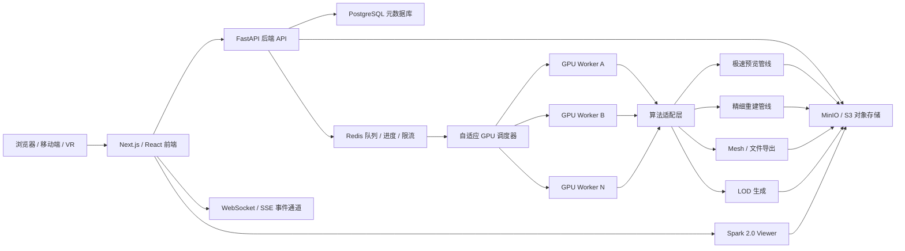

yy# 系统架构设计

## 1. 总体结构

系统采用前后端分离、任务异步化、GPU Worker 独立执行的架构。



## 2. 前端模块

| 模块 | 职责 |
| --- | --- |
| 首页 / 新建项目 | 默认入口，提供上传图片/视频和实时视频两种创建方式，显示系统资源和训练中项目 |
| 项目列表 | 展示项目、状态、创建时间、主要产物 |
| 项目详情 | 展示上传素材、任务进度、预览模型、导出入口 |
| 完整素材上传页 | 支持图片多选、视频上传、分片上传、补传、删除素材、缩略图大图预览和素材统计 |
| 实时视频页 | 左侧摄像头画面，右侧实时粗重建 Viewer，结束后支持重拍或精细重建 |
| Viewer | 使用 Spark 2.0 加载 SPZ 或 RAD 模型，支持 LOD |
| 任务进度 | 通过 WebSocket 或 SSE 接收任务状态和进度 |
| 导出面板 | 发起 Mesh 导出，展示导出文件和下载链接 |
| 用户总览 | 展示项目总数、训练中数量、已完成数量和总占用 |
| 问题反馈 | 用户提交问题、截图、项目关联和联系方式 |
| 管理面板 | 展示 GPU、队列、Worker、用户存储和任务日志 |
| 关于页面 | 展示算法许可证和非商业限制 |

## 3. 后端模块

| 模块 | 职责 |
| --- | --- |
| Auth | 用户认证和项目访问控制 |
| Project API | 项目创建、查询、更新、删除 |
| Upload API | 分片上传、合并、校验、对象存储写入 |
| Task API | 创建预览、精细重建、LOD、Mesh 导出任务 |
| Event API | 推送任务进度、状态变化和错误信息 |
| Storage Service | 封装 MinIO/S3 路径、签名 URL、生命周期策略 |
| Media Service | 管理项目原始图片、视频、缩略图、删除和补传 |
| Statistics Service | 统计用户项目数、存储占用、训练占用和系统资源 |
| Feedback Service | 保存用户反馈、附件和处理状态 |
| Scheduler | 从 Redis 获取任务并分配 GPU Worker |
| Worker Agent | 执行算法适配器、产物上传、日志回传 |
| Resource Monitor | 采集 CPU、GPU、显存、队列和 Worker 心跳 |
| License Registry | 保存算法许可证、版本和权重来源 |

## 4. 算法适配层

算法适配层的目标是屏蔽各算法仓库的输入输出差异，让 Worker 只处理统一任务格式。

算法适配层必须调用真实算法代码。未安装算法、缺少权重、GPU 不满足要求或许可证信息未登记时，应返回明确错误，不能生成假产物标记任务成功。

### 统一输入

- `project_id`
- `task_id`
- `input_type`: `images`、`video`、`camera`
- `raw_uri`
- `work_dir`
- `pipeline`: `preview`、`fine`、`mesh_export`、`lod`
- `options`: 系统自动生成的执行参数

### 统一输出

- `status`: `succeeded` 或 `failed`
- `artifacts`: 产物清单
- `metrics`: 耗时、点数、帧率、质量指标
- `logs`: 关键日志路径
- `error`: 失败原因
- `suggestions`: 素材质量提示，例如建议补拍方向、模糊图片、覆盖不足区域

## 5. 算法管线

| 场景 | 管线 |
| --- | --- |
| 图片极速预览 | 默认 LiteVGGT → EDGS → Spark-SPZ；可选 LiteVGGT → Spark-SPZ 粗预览 |
| 视频极速预览 | LingBot-Map → Spark-SPZ |
| 实时摄像头 | LingBot-Map streaming → 增量 `preview_segment_*.spz` |
| 精细重建 | Faster-GS + FastGS + Deblurring-3DGS + 3DGS-LM |
| 稀疏视角 | FreeSplatter 初始化 → 精细合成引擎 |
| 长视频精细重建 | 可选 LingBot-Map + MASt3R + Pi3 → 精细合成引擎 |
| Mesh 导出 | MeshSplatting → `.ply` / `.obj` / `.glb` |
| LOD 生成 | EcoSplat + RAP → 多级 `.rad` + `.spz` fallback |

## 6. 调度策略

- 预览任务优先于精细重建任务。
- 轻量预览任务可以在同一 GPU 上并发执行。
- 精细重建和 Mesh 导出默认独占 GPU。
- 调度器每 5 秒读取 Worker 心跳、显存、利用率和任务状态。
- 任务失败后可根据失败类型决定是否重试，算法执行失败默认不盲目重试。
- 高并发场景下，上传、查询、事件推送和静态资源下载不能阻塞 GPU 任务调度。
- 多 GPU 场景下，调度器应记录每张 GPU 的显存、利用率、当前任务、预计释放时间，并按任务类型分配。

## 7. 部署建议

毕业设计阶段建议先实现单机可运行版本：

```text
frontend        Next.js / React
backend         FastAPI
database        PostgreSQL
queue/cache     Redis
object storage  MinIO
worker          Python GPU Worker
viewer          Spark 2.0
```

后续扩展到多机时，只需要增加 GPU Worker 节点，并让 Worker 连接同一 Redis、PostgreSQL 和对象存储。

## 7. 当前实现同步

- API 服务、image-worker、video-worker、camera-worker、PostgreSQL、Redis、MinIO、frontend 已在 Compose 中拆分为独立服务。
- API 使用 SQLAlchemy 2.x 模型和 Alembic 迁移；启动时 seed 默认管理员和算法登记记录。
- image-worker 使用 LiteVGGT/EDGS/Spark 独立镜像；video-worker 与 camera-worker 使用 LingBot-Map/Spark 独立镜像，避免算法依赖相互污染。
- 本机 CPU-only 开发环境允许 SQLite/本地对象存储适配用于测试，但 Docker/WSL 目标架构以 PostgreSQL、Redis、MinIO 为准。

## 8. GPU 预览链路同步

- 图片预览镜像使用 Python 3.12 和 CUDA devel，在构建期自动安装 LiteVGGT、EDGS、Spark；模型权重由 worker 启动预检在共享 `model-cache` 中自动补齐。
- 视频/摄像头预览镜像使用 Python 3.10、CUDA 12.8、PyTorch 2.8.0 cu128 和 LingBot-Map；权重固定为 `model-cache/lingbot-map/lingbot-map-long.pt`，缺失时通过断点续传下载到共享缓存。
- 图片链路默认为 `LiteVGGT COLMAP export` -> `EDGS train` -> `Spark-SPZ convert`，可通过 `preview_pipeline=litevggt_spark` 跳过 EDGS。
- 视频链路为 `LingBot-Map native video input` -> `Spark-SPZ convert`，不再默认走 FFmpeg -> LiteVGGT -> EDGS，也不在平台层预先抽帧。
- 实时摄像头链路为浏览器 MediaRecorder 分片 -> `preview_camera_tasks` -> `LingBot-Map streaming` -> 增量 SPZ segment -> SSE 通知 Viewer 增量加载。
- 图片项目至少 1 张图片；视频项目直接把原始视频交给 LingBot-Map 的 `video_path` 输入，由 LingBot 适配层按 `lingbot_fps`/`LINGBOT_VIDEO_FPS` 读取视频，不在平台层做抽帧采样。
- 前端 Spark Viewer 通过 npm 依赖随 Next.js 构建打包，运行时只访问后端 API 和对象存储产物 URL。

## 9. 渐进式渲染与 LOD 加载

- Worker 可为视频或摄像头任务输出多个 `preview_spz_segment` artifact；metadata 记录 `segment_index`、时间窗口、LOD 和估算 splat 数。
- `GET /api/projects/{project_id}/viewer-config` 返回 `mode=single` 或 `mode=progressive`；progressive 模式返回按时间排序的 segment URL 列表。
- Viewer 通过 SSE 监听 `preview_segment_ready`，收到事件后刷新 viewer-config，只加载新增片段，不等待完整 `preview.spz`。
- Viewer 以 500 万 Gaussians 为默认预算，根据 FPS、网络状况和时间线位置自动降低远处/旧片段的 LOD 质量，目标保持 90 FPS。
