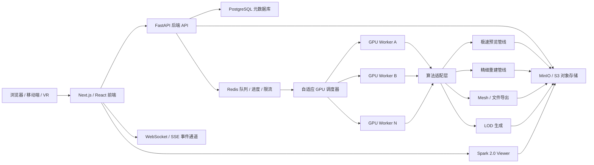

# 系统架构设计

## 1. 总体结构

系统采用前后端分离、任务异步化、GPU Worker 独立执行的架构。



## 2. 前端模块

| 模块 | 职责 |
| --- | --- |
| 首页 / 新建项目 | 默认入口，提供上传图片/视频和实时视频两种创建方式，显示系统资源和训练中项目 |
| 项目列表 | 展示项目、状态、创建时间、主要产物 |
| 项目详情 | 展示上传素材、任务进度、预览模型、导出入口 |
| 完整素材上传页 | 支持图片多选、视频上传、分片上传、补传、删除素材、缩略图大图预览和素材统计 |
| 实时视频页 | 左侧摄像头画面，右侧实时粗重建 Viewer，结束后支持重拍或精细重建 |
| Viewer | 使用 Spark 2.0 加载 SPZ 或 RAD 模型，支持 LOD |
| 任务进度 | 通过 WebSocket 或 SSE 接收任务状态和进度 |
| 导出面板 | 发起 Mesh 导出，展示导出文件和下载链接 |
| 用户总览 | 展示项目总数、训练中数量、已完成数量和总占用 |
| 问题反馈 | 用户提交问题、截图、项目关联和联系方式 |
| 管理面板 | 展示 GPU、队列、Worker、用户存储和任务日志 |
| 关于页面 | 展示算法许可证和非商业限制 |

## 3. 后端模块

| 模块 | 职责 |
| --- | --- |
| Auth | 用户认证和项目访问控制 |
| Project API | 项目创建、查询、更新、删除 |
| Upload API | 分片上传、合并、校验、对象存储写入 |
| Task API | 创建预览、精细重建、LOD、Mesh 导出任务 |
| Event API | 推送任务进度、状态变化和错误信息 |
| Storage Service | 封装 MinIO/S3 路径、签名 URL、生命周期策略 |
| Media Service | 管理项目原始图片、视频、缩略图、删除和补传 |
| Statistics Service | 统计用户项目数、存储占用、训练占用和系统资源 |
| Feedback Service | 保存用户反馈、附件和处理状态 |
| Scheduler | 从 Redis 获取任务并分配 GPU Worker |
| Worker Agent | 执行算法适配器、产物上传、日志回传 |
| Resource Monitor | 采集 CPU、GPU、显存、队列和 Worker 心跳 |
| License Registry | 保存算法许可证、版本和权重来源 |

## 4. 算法适配层

算法适配层的目标是屏蔽各算法仓库的输入输出差异，让 Worker 只处理统一任务格式。

算法适配层必须调用真实算法代码。未安装算法、缺少权重、GPU 不满足要求或许可证信息未登记时，应返回明确错误，不能生成假产物标记任务成功。

### 统一输入

- `project_id`
- `task_id`
- `input_type`: `images`、`video`、`camera`
- `raw_uri`
- `work_dir`
- `pipeline`: `preview`、`fine`、`mesh_export`、`lod`
- `options`: 系统自动生成的执行参数

### 统一输出

- `status`: `succeeded` 或 `failed`
- `artifacts`: 产物清单
- `metrics`: 耗时、点数、帧率、质量指标
- `logs`: 关键日志路径
- `error`: 失败原因
- `suggestions`: 素材质量提示，例如建议补拍方向、模糊图片、覆盖不足区域

## 5. 算法管线

| 场景 | 管线 |
| --- | --- |
| 图片极速预览 | LiteVGGT → EDGS → `preview.spz` + `preview_lod1.rad` |
| 视频极速预览 | Stream3R 或 LiteVGGT → `preview.spz` |
| 实时摄像头 | Stream3R 流式更新 → `preview_live.spz` |
| 精细重建 | Faster-GS + FastGS + Deblurring-3DGS + 3DGS-LM |
| 稀疏视角 | FreeSplatter 初始化 → 精细合成引擎 |
| 长视频精细重建 | 可选 LingBot-Map + MASt3R + Pi3 → 精细合成引擎 |
| Mesh 导出 | MeshSplatting → `.ply` / `.obj` / `.glb` |
| LOD 生成 | EcoSplat + RAP → 多级 `.rad` + `.spz` fallback |

## 6. 调度策略

- 预览任务优先于精细重建任务。
- 轻量预览任务可以在同一 GPU 上并发执行。
- 精细重建和 Mesh 导出默认独占 GPU。
- 调度器每 5 秒读取 Worker 心跳、显存、利用率和任务状态。
- 任务失败后可根据失败类型决定是否重试，算法执行失败默认不盲目重试。
- 高并发场景下，上传、查询、事件推送和静态资源下载不能阻塞 GPU 任务调度。
- 多 GPU 场景下，调度器应记录每张 GPU 的显存、利用率、当前任务、预计释放时间，并按任务类型分配。

## 7. 部署建议

毕业设计阶段建议先实现单机可运行版本：

```text
frontend        Next.js / React
backend         FastAPI
database        PostgreSQL
queue/cache     Redis
object storage  MinIO
worker          Python GPU Worker
viewer          Spark 2.0
```

后续扩展到多机时，只需要增加 GPU Worker 节点，并让 Worker 连接同一 Redis、PostgreSQL 和对象存储。

## 7. 当前实现同步

- API 服务、preview worker、PostgreSQL、Redis、MinIO、frontend 已在 Compose 中拆分为独立服务。
- API 使用 SQLAlchemy 2.x 模型和 Alembic 迁移；启动时 seed 默认管理员和算法登记记录。
- preview worker 与 API 共享同一数据库、对象存储和算法 registry，但只有 worker 执行真实算法命令。
- 本机 CPU-only 开发环境允许 SQLite/本地对象存储适配用于测试，但 Docker/WSL 目标架构以 PostgreSQL、Redis、MinIO 为准。
