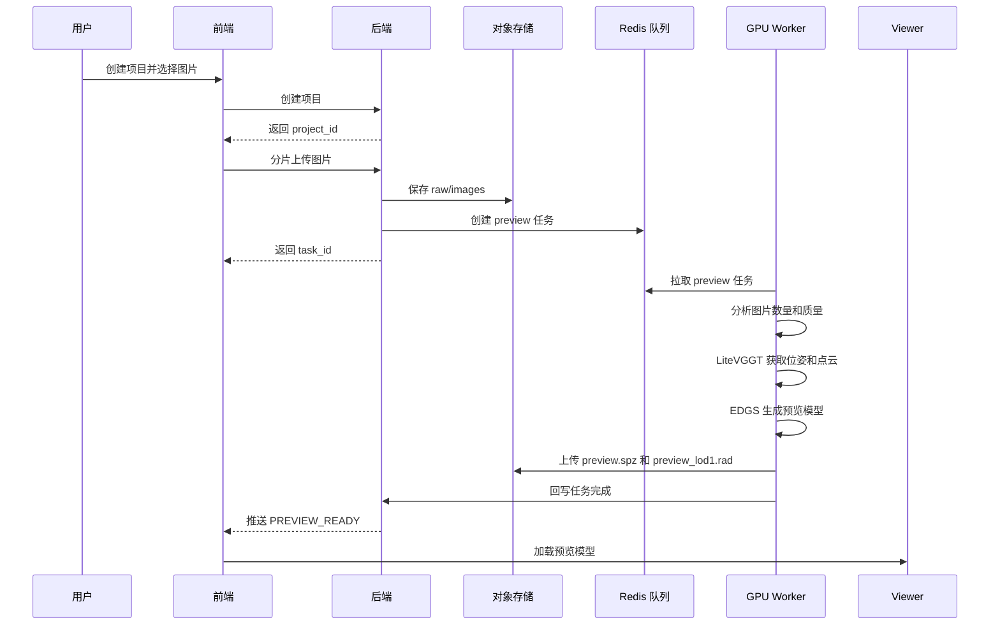
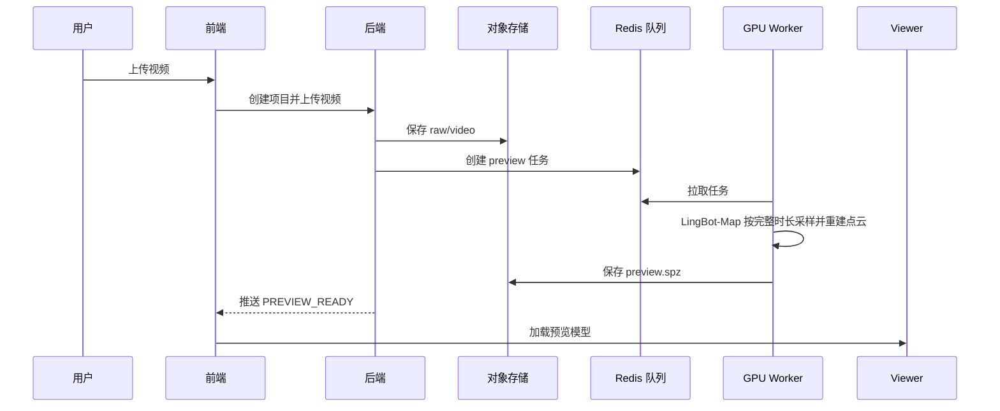
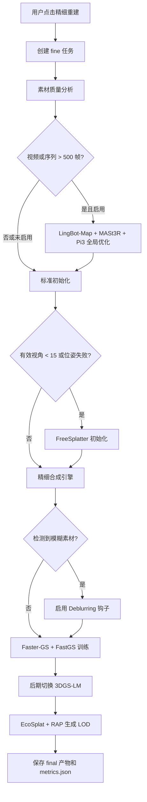
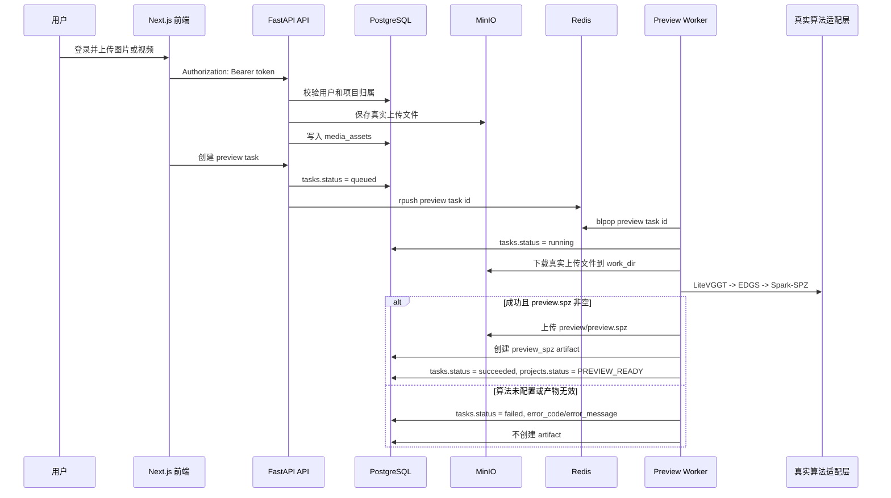

# 核心流程与状态机

## 1. 项目状态机

```text
CREATED
  -> UPLOADING
  -> PREPROCESSING
  -> PREVIEW_RUNNING
  -> PREVIEW_READY
  -> FINE_QUEUED
  -> GLOBAL_OPTIMIZING
  -> FINE_RUNNING
  -> COMPLETED

任意运行中状态
  -> FAILED
  -> CANCELED

COMPLETED
  -> MESH_EXPORT_RUNNING
  -> MESH_EXPORT_READY
```

`GLOBAL_OPTIMIZING` 只在长视频精细重建且开启全局优化时出现。

## 2. 图片极速预览流程



## 3. 视频极速预览流程



## 4. 实时摄像头粗重建流程

1. 前端请求摄像头权限。
2. 前端将视频帧按固定频率发送到后端或实时 Worker。
3. 前端使用 MediaRecorder 每 1 秒上传一个视频窗口。
4. API 创建 `preview_camera_tasks` 任务，camera-worker 使用 LingBot-Map streaming 模式生成窗口级点云。
5. Worker 将窗口级点云转换为 `preview_segment_*.spz`，写入 `preview_spz_segment` artifact。
6. Viewer 通过 SSE 收到 `preview_segment_ready` 后拉取新增 segment 并追加渲染；未完成时间段显示为灰色占位。

## 5. 精细重建流程



## 6. Mesh 导出流程

1. 用户在项目详情页选择导出格式。
2. 后端创建 `mesh_export` 任务。
3. Worker 读取 `final.ply`。
4. Worker 使用 MeshSplatting 生成 `.ply`、`.obj`、`.glb`。
5. 产物上传到对象存储。
6. 后端生成签名 URL 并返回前端。

## 7. 任务优先级

| 任务类型 | 优先级 | GPU 策略 |
| --- | --- | --- |
| 实时摄像头 | 最高 | 低延迟，持续运行 |
| 极速预览 | 高 | 可并发，快速返回 |
| LOD 生成 | 中 | 可与部分轻量任务错峰 |
| Mesh 导出 | 中 | 默认独占 GPU |
| 精细重建 | 低 | 默认独占 GPU，长任务 |

## 8. 失败处理

- 上传失败：允许用户重新上传失败分片。
- 预处理失败：项目进入 `FAILED`，保留错误日志。
- 预览失败：允许重新发起预览任务。
- 精细重建失败：保留预览结果，不删除已有产物。
- 导出失败：不影响项目最终重建结果。
- 用户取消：任务进入 `CANCELED`，Worker 应尽快停止并清理临时目录。

## 9. 当前实现同步

当前预览任务的真实执行路径如下：



当前状态规则：

- API 创建预览任务后只允许进入 `queued`；不得在请求线程内直接执行算法。
- worker 接手后进入 `running`，并写入 `worker_id`、`current_stage`、`started_at`。
- 算法环境失败时进入 `failed`，项目进入 `FAILED`，`artifacts` 表不新增成功产物。
- 只有真实非空 `preview.spz` 上传成功后，任务才进入 `succeeded`，项目进入 `PREVIEW_READY`。
- viewer config 存在 `preview_spz` 时返回 `mode=single`；存在 `preview_spz_segment` 时返回 `mode=progressive` 和 segment 列表；都不存在时返回 `unavailable`。
- 当前取消接口只持久化 `canceled` 状态；正在执行的外部算法进程中断和临时目录清理属于后续增强。
