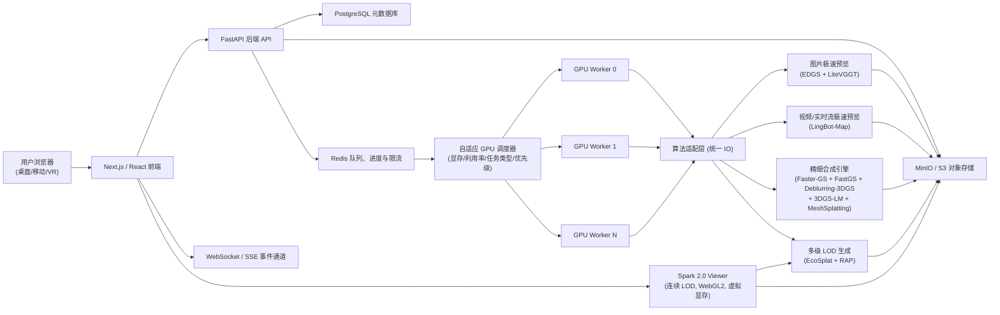
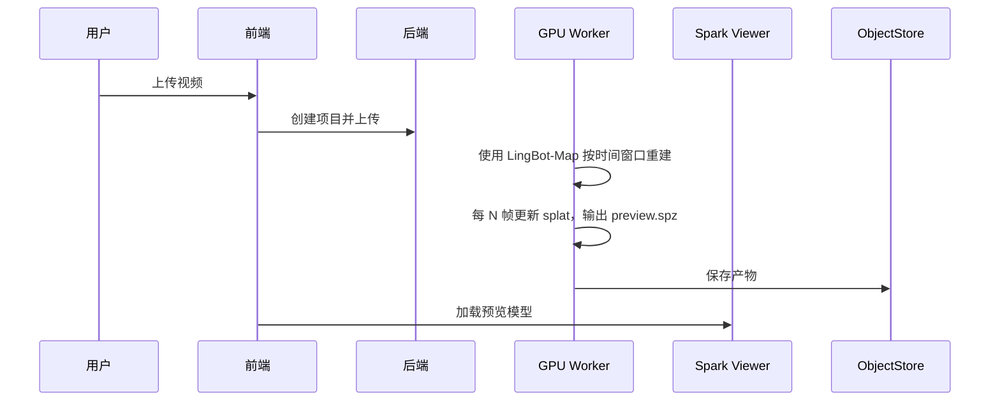
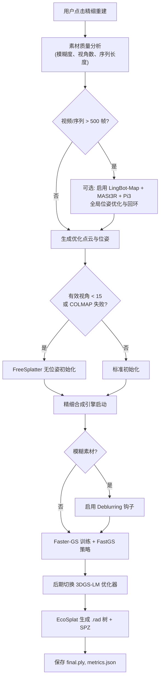

# 3DGS 重建系统——最终架构设计文档

**版本**：v2.1  
**更新日期**：2026-04-25  
**适用场景**：非商业研究、毕业设计、实验室内部使用

---

## 1. 系统目标

本系统构建从图像/视频/实时摄像头采集到 3D Gaussian Splatting（3DGS）重建、交互式 Web 查看、项目管理、导出与分享的一体化平台。系统始终坚持以下原则：

- **算法自动决策**：前端不暴露算法选择，用户仅指定操作意图（上传、极速预览、精细重建、导出 PLY/Mesh、分享）。后端根据输入类型、数据量、质量指标自动执行最优固定管线。
- **速度与质量解耦**：极速重建管线追求秒级启动、数分钟产出可交互的粗模型；精细重建管线深度融合多种增强算法，保障高保真、抗模糊、抗稀疏视角。
- **大规模图片支持**：针对 800 张以上的图片输入，自动切换为轻量级位姿估计器 LiteVGGT，避免传统方案（如 MASt3R）的计算爆炸。
- **自适应渲染**：Web 端采用连续 LOD（层次细节）技术，根据设备性能、屏幕分辨率、视距动态选择模型细节级别，实现“先显示基础层，逐渐提升清晰度”的用户体验。
- **高并发与可扩展**：通过分布式 GPU 调度、任务优先级和对象存储直连保障多用户并发训练/预览需求。
- **合规与可审计**：所有第三方算法均记录许可证、commit hash 与权重来源；全链路任务、产物、分享操作可追踪。

---

## 2. 总体架构



**架构关键升级**：
- **自适应 GPU 调度器**：根据显存、利用率、任务类型（预览/精细/导出）和用户优先级动态分配 Worker，支持单 GPU 内并发执行多个轻量预览任务。
- **位姿估计动态切换**：根据图片数量自动选择 MASt3R（≤200 张）或 LiteVGGT（>200 张），兼顾精度与速度。
- **精细合成引擎**：将 Faster‑GS、FastGS、Deblurring‑3DGS、3DGS‑LM 和 MeshSplatting 融合为单一 CUDA 进程，消除跨模块通信与重复显存分配。
- **多级 LOD 生成**：利用 EcoSplat 生成连续层次细节 .rad 文件，配合 Spark 2.0 实现自适应渲染。

---

## 3. 算法选型总览

| 模块                   | 选定算法                                                                                                      | 关键特性                                                                 | 许可证 (注意集成约束)               |
|------------------------|---------------------------------------------------------------------------------------------------------------|--------------------------------------------------------------------------|-------------------------------------|
| **位姿估计（小规模）** | [MASt3R](https://github.com/naver/mast3r) (ECCV 2024)                                                         | 稠密匹配、度量尺度，生态丰富，适用于 ≤200 张图片                        | CC BY‑NC‑SA 4.0                     |
| **位姿估计（大规模）** | [LiteVGGT](https://github.com/GarlicBa/LiteVGGT-repo) (arXiv 2025)                                            | 几何感知令牌合并，10× 加速，支持 1000+ 张图片，127s 完成 1000 帧        | Apache‑2.0                          |
| **图片极速预览**       | [EDGS](https://github.com/CompVis/EDGS) (CVPR 2026)                                                           | 密集初始化替代增稠，仅需 60% splats，训练快至 11s                        | Apache‑2.0                          |
| **视频/实时流极速重建** | [LingBot‑Map](https://github.com/Robbyant/lingbot-map)                                                       | streaming/windowed 推理，输出窗口级点云与位姿，可生成增量 SPZ 片段       | Apache‑2.0                          |
| **精细重建主框架**     | [Faster‑GS](https://github.com/nerficg-project/faster-gaussian-splatting) (CVPR 2026) 合成引擎                | 混合 MCMC 增稠/剪枝、融合反向传播，5× 加速，模块化                       | Apache‑2.0 (基础)                   |
| **精细训练加速策略**   | [FastGS](https://github.com/fastgs/FastGS) (CVPR 2026) (注入)                                                 | 多视角一致性剪枝，3× 快于 DashGaussian，无缝集成 Faster‑GS               | MIT                                 |
| **模糊输入增强**       | [Deblurring‑3DGS](https://github.com/benhenryL/Deblurring-3D-Gaussian-Splatting) (ECCV 2024) (钩子)           | 训练时建模模糊核，推理时清晰输出                                         | 原始 Inria 3DGS 许可证 (非商业)     |
| **精细化 finetune**    | [3DGS‑LM](https://github.com/lukasHoel/3DGS-LM) (ICCV 2025) (替换优化器)                                     | Levenberg‑Marquardt 优化器，JVP kernel，提升 PSNR 0.5~1dB               | MIT                                 |
| **Mesh 导出**          | [MeshSplatting](https://github.com/meshsplatting/mesh-splatting) (CVPR 2026) (同进程)                         | 可微分不透明 Mesh 渲染，复用合成引擎 CUDA 上下文                         | Apache‑2.0 (受原始 3DGS 非商业限制) |
| **无位姿稀疏视角增强** | [FreeSplatter](https://github.com/TencentARC/FreeSplatter) (ICCV 2025)                                        | 无标定直接预测 3DGS，适配极稀疏视角                                     | Apache‑2.0 (核心代码)               |
| **长视频闭环优化**     | [LingBot‑Map](https://github.com/Robbyant/lingbot-map) + [MASt3R](https://github.com/naver/mast3r) + [Pi3](https://github.com/yyfz/Pi3) (可选) | 流式位姿+回环检测+排列等变一致性优化，仅用于精细重建长视频场景            | LingBot‑Map Apache‑2.0; MASt3R CC BY‑NC‑SA; Pi3 MIT |
| **LOD 生成**           | [EcoSplat](https://github.com/KAIST-VICLab/EcoSplat) (CVPR 2026) + RAP                                      | primitive_ratio 控制 splat 数量，输出多级 .rad                           | MIT / RAP 许可证                    |
| **Web 渲染**           | [Spark 2.0](https://github.com/sparkjsdev/spark)                                                              | 连续 LOD，虚拟显存，流式加载，自适应性能                                 | MIT                                 |

**位姿估计的动态选择策略**：
- 图片数量 ≤ 200：使用 **MASt3R**，精度最高，配对匹配可接受。
- 图片数量 > 200 且 ≤ 2000：使用 **LiteVGGT**，单次前向推理完成全局位姿，避免 O(n²) 匹配爆炸。
- 视频/实时流：极速预览使用 **LingBot‑Map** streaming/windowed 模式生成点云与位姿，再转换为 Spark-SPZ。

---

## 4. 算法深度融合方案

### 4.1 精细合成引擎：一进程多能力

将 Faster‑GS 作为主框架，通过回调/钩子方式集成：

- **FastGS**：其加速策略（Fast-DropGaussian 等）以 `densify_and_prune` 回调注入，共享梯度与 CUDA 流。
- **Deblurring‑3DGS**：在 forward 前对高斯参数施加可学习的模糊核，推理时自动跳过，仅当预处理检测到模糊素材时启用。
- **3DGS‑LM**：训练后期（70% 迭代后）将 Adam 替换为 Levenberg‑Marquardt 优化器，以提升最终精度。
- **MeshSplatting**：在精细重建完成后，直接在同一个 CUDA 上下文中加载 PLY 执行 Mesh 优化与导出，避免重新初始化显存。

**稀疏视角/无位姿场景**：
- 若有效视角数 < 15 或 COLMAP 失败，系统自动调用 **FreeSplatter** 生成初始高斯，再送入合成引擎训练。

**长视频精细重建的可选前置优化**：
- 当输入为长视频（>500 帧）时，可启用 **LingBot‑Map → MASt3R → Pi3** 管线进行位姿校正与闭环，生成优化后的点云和位姿，再交给合成引擎。此非默认项，需用户或预设开启。

### 4.2 极速预览方案的分流设计

| 输入类型             | 位姿估计                                  | 3DGS 训练 | 备注                                                         |
|----------------------|-------------------------------------------|-----------|--------------------------------------------------------------|
                                       |
| 图片 (含 800+) | LiteVGGT                                | EDGS      | 大规模位姿加速，EDGS 直接利用 LiteVGGT 密集点云初始化         |
| 视频 / 实时摄像头    | LingBot‑Map      | -         | 按视频窗口或摄像头分片输出粗 splat，无需额外训练              |

**为什么极速预览只使用 LingBot‑Map 单算法？**  
LingBot‑Map 已覆盖视频和实时摄像头的 streaming/windowed 粗重建能力；MASt3R/Pi3 仍只作为长视频精细重建前的可选全局优化，避免把高延迟闭环优化放进实时预览路径。

### 4.3 多级 LOD 与自适应渲染

- **生成**：精细重建或预览完成后，EcoSplat 根据 `primitive_ratio` 从原始 PLY 生成 3~4 个细节级别（如 L0: 100%, L1: 40%, L2: 10%, L3: 3%），输出对应 .rad 文件，并保留一份 SPZ 作为 fallback。
- **渲染**：Spark 2.0 Viewer 根据设备 GPU 显存、屏幕像素比、视距动态请求对应 .rad 块。用户打开页面时立即展示 L3 粗糙基础层，随后 1~2 秒内逐步替升至 L0 全细节，全程保持 ≥30 fps。

---

## 5. 固定算法路线（最终版）

| 管线环节             | 固定算法 / 工具                                                         |
|----------------------|-------------------------------------------------------------------------|
| 图片极速预览         | `位姿估计（ LiteVGGT）` → `EDGS` → 产物 .spz + L1.rad        |
| 视频极速预览         | `LingBot‑Map` → `Spark-SPZ`                                            |
| 实时摄像头粗重建     | `LingBot‑Map` streaming → 增量 `preview_segment_*.spz`                 |
| 精细重建主引擎       | `精细合成引擎（Faster‑GS + FastGS + Deblurring‑3DGS + 3DGS‑LM）`       |
| 稀疏视角初始化       | `FreeSplatter`（自动启用）                                              |
| 长视频精细重建前优化 | `LingBot‑Map + MASt3R + Pi3`（可选，需手动或按规则启用）               |
| Mesh 导出            | `MeshSplatting`（在合成引擎同一进程中完成）                            |
| 产物压缩与 LOD 生成  | `EcoSplat` + `RAP`（输出 .rad 树与 .spz）                              |
| Web 3DGS 渲染        | `Spark 2.0`（连续 LOD，自适应性能）                                    |

---

## 6. 核心业务流程（更新）

### 6.1 图片上传极速预览（含大规模图片）

```mermaid
sequenceDiagram
    participant U as 用户
    participant FE as 前端
    participant API as 后端
    participant S3 as 对象存储
    participant W as GPU Worker
    participant V as Spark 2.0 Viewer

    U->>FE: 新建项目，上传图片（可能>800张）
    FE->>API: 创建项目并分片上传
    API->>S3: 保存至 raw/images
    API->>Redis: 入队预览任务
    W->>W: 分析图片数量与质量
    W->>W: 调用 LiteVGGT 获取位姿与点云
    end
    W->>W: EDGS 密集初始化并训练 (约 20s)
    W->>W: 生成 preview.spz 及 L1.rad
    W->>S3: 上传产物
    API-->>FE: 推送完成通知
    FE->>V: 加载 L1.rad 立即显示，后台加载高清层
```

### 6.2 视频上传极速预览



### 6.3 实时摄像头粗重建

前端使用 MediaRecorder 按时间窗口上传摄像头分片，camera-worker 使用 LingBot-Map streaming 模式处理，每个窗口生成一个 `preview_segment_*.spz`，Viewer 通过 SSE 收到 `preview_segment_ready` 后增量加载。

### 6.4 精细重建



### 6.5 Mesh 导出

复用精细合成引擎进程，直接加载 PLY 并执行 MeshSplatting，输出 .ply / .obj / .glb。

---

## 7. 标准产物

| 产物               | 用途                                                   |
|--------------------|--------------------------------------------------------|
| `preview.spz`      | 极速预览 Web 渲染主文件                                 |
| `preview_lod1.rad` | 极速预览的低细节 LOD 包（快速显示）                     |
| `final.ply`        | 精细重建标准导出文件                                   |
| `final_web.spz`    | 精细重建 Web 渲染 fallback                              |
| `final_lod0.rad` ~ `final_lod3.rad` | 精细模型的 4 级层次细节，供 Spark 2.0 动态加载 |
| `final_mesh.ply`, `.obj`, `.glb` | Mesh 导出格式                               |
| `metrics.json`     | 训练耗时、点数、质量指标                                |
| `global_opt.log`   | 长视频闭环优化日志（若启用）                            |

---

## 8. 项目状态机

```
CREATED → UPLOADING → PREPROCESSING → PREVIEW_RUNNING → PREVIEW_READY
       → FINE_QUEUED → [GLOBAL_OPTIMIZING] → FINE_RUNNING → COMPLETED
       → FAILED / CANCELED
COMPLETED → MESH_EXPORT_RUNNING → MESH_EXPORT_READY
```

**新增状态**：`GLOBAL_OPTIMIZING` 仅在精细重建且开启长视频优化时出现。

---

## 9. 非功能要求与优化

### 9.1 高并发与自适应调度
- **API 层**：FastAPI + async db pool，热点数据缓存在 Redis。
- **任务队列**：Redis Streams 实现优先级队列，极速预览优先于精细重建，支持 VIP 权重。
- **自适应 GPU 调度器**：每 5s 轮询 Worker 显存/利用率，将轻量预览任务并发至同一 GPU，大任务独占 GPU。
- **自适应渲染**：Spark 2.0 根据设备 `navigator.hardwareConcurrency`、WebGL 限制自动选择初始 LOD 级别，并动态切换。

### 9.2 存储与传输
- 分片上传、断点续传，用户隔离前缀。
-  .rad 文件 (30d)，SPZ (7d)，版本化强缓存。
- 下载包生成签名 URL，1 小时有效。

### 9.3 稳定性与审计
- 所有 Worker 执行日志全量记录，超时控制：预览 5min，精细 2h，Mesh 导出 30min。
- 管理员面板：实时 GPU 负载、队列深度、平均耗时、用户存储占用。

---

## 10. 许可证与使用限制

本系统仅供非商业学术研究。所有集成第三方仓库均需记录许可证和 commit hash，并在系统“关于”页面展示。关键约束：

- **精细合成引擎**内部包含 Debblurring‑3DGS 和 MeshSplatting 等组件，它们继承自原始 Inria 3DGS 的非商业许可证。因此整个精细合成引擎在分发时必须标注受该许可证约束，**禁止直接或间接用于商业目的**。
- **FreeSplatter** 核心代码为 Apache‑2.0，但其依赖的 Hunyuan3D‑1、RMBG‑2.0 模型存在非商业附加限制，集成时需确保合规。
- **LingBot‑Map** 使用 Apache‑2.0；权重来源和具体文件 URL 需在部署环境中登记或通过 `LINGBOT_WEIGHT_URL` 指定。
- **MASt3R** 使用 CC BY‑NC‑SA 4.0，符合本系统非商业定位。
- **LiteVGGT, EDGS, Faster‑GS, FastGS, 3DGS‑LM, EcoSplat, Spark 2.0** 等均为宽松许可证 (MIT/Apache‑2.0)，可放心集成。

---

## 11. 验收标准 (v2.1)

1. **图片极速预览**：
   - 上传 图片,使用 LiteVGGT + EDGS，总耗时 ≤ 3 分钟，产出同样可用。
2. **视频极速预览**：1080p 30s 视频，LingBot-Map 生成非空 `preview.spz`，Viewer 加载后以 90 FPS 为目标自适应渲染。
3. **实时摄像头**：720p 摄像头按窗口上传，LingBot-Map 生成增量 SPZ segment，Viewer 可在任务完成前浏览已完成片段。
4. **精细重建**：
   - 正常素材：合成引擎自动训练，产出 `final.ply`、`final_web.spz` 和 LOD .rad 树。
   - 模糊/稀疏视角：自动启用 Deblurring 或 FreeSplatter 增强，最终 PSNR 显著优于未增强 baseline。
   - 长视频（>500 帧）：可选开启全局优化，无明显漂移。
5. **Mesh 导出**：生成 `.ply`, `.obj`, `.glb`，可在三方软件中正常打开。
6. **自适应渲染**：桌面/移动设备打开同一模型，初始细节不同但都保持流畅，随后逐步提升。
7. **管理面板**：实时显示各 GPU 任务、队列、用户统计。
8. **许可证展示**：前端“关于”页列出所有算法及其许可证，并附原仓库链接。

---

**文档结束**

*本架构设计将根据算法社区最新进展持续迭代。所有集成实验必须在受控环境中验证融合效果，并严格遵循各算法许可证条款。*
